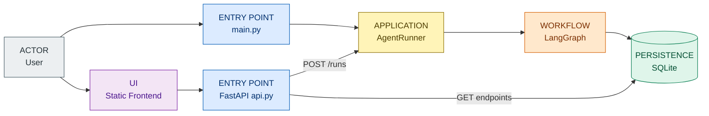
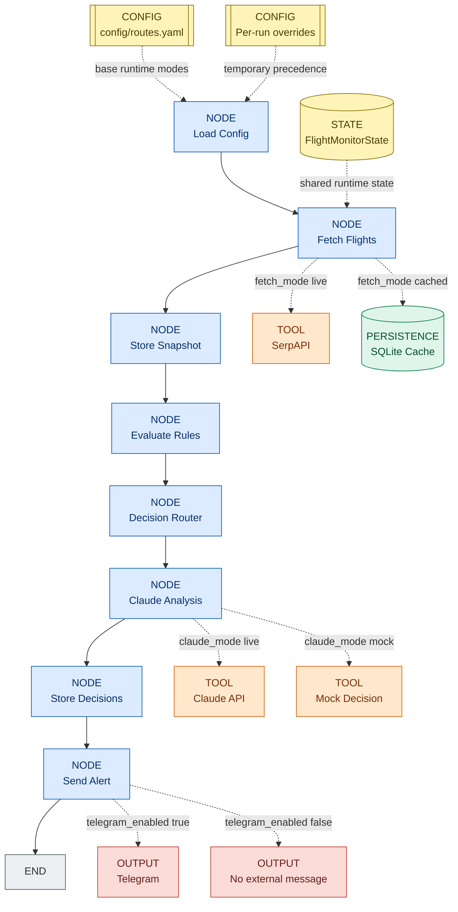

# flight-agent Architecture

## 1. Purpose

`flight-agent` is a Python agent that monitors flight prices for a family trip around Thanksgiving 2026.

Current monitored routes:

```text
LIM -> MAD
MAD -> MCO
MCO -> LIM
```

The goal of this project is not only to monitor flights, but to learn how to design, document and reason about an AI agent architecture in a simple, inspectable way.

---

## 2. Architectural Pattern

The project follows an **Enterprise Agentic Workflow**:

```text
rules first, LLM only when useful
```

The normal flow is deterministic:

```text
load config
fetch flights
evaluate rules
route decisions
store results
notify if needed
```

Claude is bounded. It does not control the whole process. It only analyzes cases marked as ambiguous by the router.

This keeps the agent:

```text
cheaper
more stable
more auditable
easier to debug
```

---

## 3. System Views

The architecture is shown with two complementary views:

```text
System Architecture
  who enters the system and which component calls which

Agent Workflow
  what happens inside LangGraph during one run
```

### 3.1 System Architecture



`main.py` and `api.py` are entry points. They do not own the internal execution logic. Both delegate agent execution to `AgentRunner`, while the read endpoints query SQLite without executing LangGraph.

### 3.2 Agent Workflow

This view starts after `AgentRunner` invokes LangGraph.



Accessibility note: the diagram does not rely only on color. Each box also includes a component label such as `NODE`, `TOOL`, `PERSISTENCE`, `CONFIG`, `STATE` or `OUTPUT`.

Diagram legend:

| Visual cue | Meaning | Examples |
|---|---|---|
| `NODE` label + blue style | LangGraph nodes / workflow steps | `load_config`, `fetch_flights`, `claude_analysis` |
| `TOOL` label + orange style | External tools or simulated tool behavior | SerpAPI, Claude API, mock decision |
| `PERSISTENCE` label + green style | Durable memory / data access | SQLite cache |
| `CONFIG` / `STATE` label + yellow style | Base config, temporary overrides and runtime state | `config/routes.yaml`, per-run overrides, `FlightMonitorState` |
| `OUTPUT` label + red style | External output or skipped external output | Telegram, no external message |
| `END` label + gray style | Terminal state | END |

Important detail: `claude_analysis` is currently always present in the graph, but it only processes alerts with `tipo = ambiguous`. If there are no ambiguous cases, it exits without calling Claude.

---

## 4. Main Runtime Modes

The base runtime modes are stored in `config/routes.yaml`.

```yaml
global:
  review_mode: true
  fetch_mode: "cached"
  claude_mode: "mock"
  telegram_enabled: false
```

| Setting | Production-like value | Lab value | Purpose |
|---|---|---|---|
| `fetch_mode` | `live` | `cached` | Control SerpAPI usage |
| `claude_mode` | `live` | `mock` | Control Claude usage |
| `telegram_enabled` | `true` | `false` | Control external notifications |
| `review_mode` | `true` | `true` | Keep human review for uncertain cases |

Recommended lab mode:

```text
fetch_mode: cached
claude_mode: mock
telegram_enabled: false
```

This allows testing the full pipeline without spending SerpAPI, without spending Claude, and without sending Telegram messages.

### Per-run overrides

`POST /runs` can receive optional overrides for one execution:

```json
{
  "overrides": {
    "fetch_mode": "cached",
    "claude_mode": "mock",
    "telegram_enabled": false,
    "review_mode": true
  }
}
```

The effective configuration is built in this order:

```text
config/routes.yaml
    + temporary request overrides
    = effective configuration for one run
```

The request does not modify `routes.yaml`. `AgentRunner` validates and transports the overrides in `state.config_overrides`; `load_config` loads the YAML first and applies the overrides afterward.

The API returns `effective_config` so the caller can verify the modes actually used by the run.

---

## 5. State vs Persistence

The architecture separates temporary state from permanent memory.

### Temporary state

`FlightMonitorState` is the live working memory of one run.

Examples:

```text
latest_offers
rule_matches
suspicious_cases
alerts_to_send
global_config
config_overrides
```

It lives in RAM and disappears when the program finishes.

### Permanent persistence

SQLite stores data that must survive across runs.

Examples:

```text
flights
decisions
review_queue
agent_runs
```

`agent_runs` stores the execution summary and runtime modes. Decisions and review queue records keep the related `run_id` for traceability.

SQLite is also used as a simple local cache by reading the latest flight snapshot.

---

## 6. Snapshot and Cache

A snapshot is the set of flights found in one run.

In live mode:

```text
SerpAPI -> Flight objects -> state.latest_offers -> SQLite snapshot
```

In cached mode:

```text
SQLite latest snapshot -> Flight objects -> state.latest_offers
```

This design keeps the rest of the graph independent from the source of data.

`evaluate_rules`, `decision_router` and `claude_analysis` always read from state. They do not care whether the data came from SerpAPI or SQLite.

---

## 7. Main Components

| Component | Responsibility |
|---|---|
| `main.py` | CLI entry point; calls `AgentRunner` and prints the run summary |
| `api.py` | FastAPI entry point; validates HTTP requests and exposes read and execution endpoints |
| `runner.py` | Application-level execution boundary shared by CLI and API |
| `state.py` | Defines temporary state, per-run overrides and the `Flight` model |
| `graph.py` | Connects nodes using LangGraph |
| `nodes/load_config.py` | Loads base YAML configuration and applies temporary overrides |
| `nodes/fetch_flights.py` | Loads flights from SerpAPI or SQLite cache |
| `nodes/nodes.py` | Stores snapshots, evaluates rules, routes decisions and sends alerts |
| `nodes/claude_analysis.py` | Uses Claude or mock mode for ambiguous cases |
| `tools/claude_tool.py` | Calls Claude API and parses structured output |
| `persistence/db.py` | Encapsulates SQLite persistence and read queries used by the API |
| `catalogs/airlines.py` | Adds reference metadata to airline offers returned by the API |
| `frontend/` | Static interface that consumes the read endpoints |
| `config/routes.yaml` | Base source of truth for routes and runtime modes |

### API boundary

The API has two kinds of operations:

```text
GET endpoints
  read persisted runs, review queue and flight offers

POST /runs
  validates a RunRequest with Pydantic
  delegates execution to AgentRunner
  returns a run summary and effective_config
```

Pydantic models define the allowed request fields and reject invalid values before the graph executes. `AgentRunner` also validates overrides so the same rule applies to future entry points such as a scheduler.

---

## 8. Tools vs Persistence

The project separates agentic tools from persistence.

```text
tools/
  external capabilities used by nodes
  examples: Claude, SerpAPI, Telegram

persistence/
  permanent memory and data access
  examples: SQLite, snapshots, price history, review queue
```

`db.py` belongs conceptually to `persistence/` because it is not a tool chosen by the LLM. It is the data access layer of the system.

A more enterprise naming would be:

```text
Persistence Adapter
Repository Layer
Data Access Layer
```

For this lab, `persistence/db.py` is enough. If the project grows, it can be split later into repositories.

---

## 9. Decision Flow

The router classifies flights into three initial categories:

```text
clear_deal
ambiguous
review
```

Then Claude can transform ambiguous cases into:

```text
alert
ignore
recheck
needs_review
```

Operational meaning:

| Decision | Meaning |
|---|---|
| `clear_deal` | Deterministic good deal from rules |
| `alert` | Claude recommends notifying |
| `review` | Hard rule says manual review |
| `needs_review` | Claude recommends human review |
| `recheck` | Candidate should be monitored again |
| `ignore` | Not worth action now |

---

## 10. Current File Structure

```text
flight-agent/
├── api.py
├── architecture.md
├── checkpoint.md
├── main.py
├── config/
│   └── routes.yaml
├── data/
│   └── flight_agent.sqlite
├── frontend/
│   ├── index.html
│   └── run.html
└── src/
    └── flight_agent/
        ├── graph.py
        ├── runner.py
        ├── state.py
        ├── catalogs/
        │   └── airlines.py
        ├── nodes/
        │   ├── load_config.py
        │   ├── fetch_flights.py
        │   ├── claude_analysis.py
        │   └── nodes.py
        ├── observability/
        │   └── logging.py
        ├── tools/
        │   └── claude_tool.py
        └── persistence/
            └── db.py
```

---

## 11. Architecture Principles

1. Keep the normal workflow deterministic.
2. Use Claude only for ambiguous reasoning.
3. Keep state temporary and persistence permanent.
4. Keep external effects controllable by config.
5. Avoid spending APIs during local lab runs.
6. Keep documentation didactic, not exhaustive.
7. Refactor structure only when it clarifies architecture.
8. Keep entry points thin and delegate execution to `AgentRunner`.
9. Treat `routes.yaml` as base configuration and overrides as temporary per-run input.
10. Validate external input before executing the graph.

---

## 12. Current Execution Boundary and Next Step

The current API execution is synchronous:

```text
POST /runs
  -> FastAPI validates the request
  -> AgentRunner executes the graph
  -> the HTTP request waits
  -> the API returns the final summary
```

This is sufficient for the current local laboratory because runs are short and normally use `cached` and `mock` modes.

Its known limitation is that the HTTP request remains open during the complete agent execution. If runs become long or concurrent, the next architectural evolution is to represent executions as jobs:

```text
queued
running
completed
failed
```

That future design would separate HTTP request handling from execution through a worker or scheduler. Redis, Celery or another queue are not required yet and have not been added.

A separate deferred improvement is to replace the always-connected `claude_analysis` node with a true conditional LangGraph branch:

```text
if ambiguous cases exist -> claude_analysis
else -> store_decisions
```

For now, the current implementation is valid for learning because the node itself skips work when there are no ambiguous cases.
