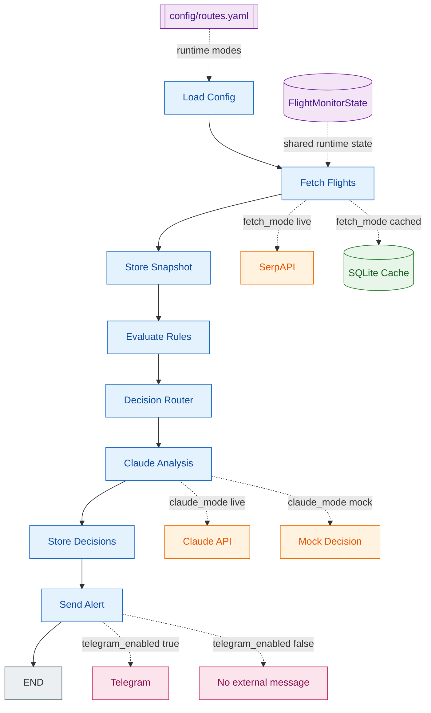

# flight-agent Architecture

## 1. Purpose

`flight-agent` is a Python agent that monitors flight prices for a family trip around Thanksgiving 2026.

Current monitored routes:

```text
LIM -> MAD
MAD -> MCO
MCO -> LIM
```

The goal of this project is not only to monitor flights, but to learn how to design, document and reason about an AI agent architecture in a simple, inspectable way.

---

## 2. Architectural Pattern

The project follows an **Enterprise Agentic Workflow**:

```text
rules first, LLM only when useful
```

The normal flow is deterministic:

```text
load config
fetch flights
evaluate rules
route decisions
store results
notify if needed
```

Claude is bounded. It does not control the whole process. It only analyzes cases marked as ambiguous by the router.

This keeps the agent:

```text
cheaper
more stable
more auditable
easier to debug
```

---

## 3. High-Level Flow



Diagram legend:

| Color | Meaning | Examples |
|---|---|---|
| Blue | LangGraph nodes / workflow steps | `load_config`, `fetch_flights`, `claude_analysis` |
| Orange | External tools or simulated tool behavior | SerpAPI, Claude API, mock decision |
| Green | Persistence / durable memory | SQLite cache |
| Purple | Runtime configuration and temporary state | `config/routes.yaml`, `FlightMonitorState` |
| Pink | External output or skipped external output | Telegram, no external message |
| Gray | Terminal state | END |

Important detail: `claude_analysis` is currently always present in the graph, but it only processes alerts with `tipo = ambiguous`. If there are no ambiguous cases, it exits without calling Claude.

---

## 4. Main Runtime Modes

The system can run in different modes using `config/routes.yaml`.

```yaml
global:
  review_mode: true
  fetch_mode: "cached"
  claude_mode: "mock"
  telegram_enabled: false
```

| Setting | Production-like value | Lab value | Purpose |
|---|---|---|---|
| `fetch_mode` | `live` | `cached` | Control SerpAPI usage |
| `claude_mode` | `live` | `mock` | Control Claude usage |
| `telegram_enabled` | `true` | `false` | Control external notifications |
| `review_mode` | `true` | `true` | Keep human review for uncertain cases |

Recommended lab mode:

```text
fetch_mode: cached
claude_mode: mock
telegram_enabled: false
```

This allows testing the full pipeline without spending SerpAPI, without spending Claude, and without sending Telegram messages.

---

## 5. State vs Persistence

The architecture separates temporary state from permanent memory.

### Temporary state

`FlightMonitorState` is the live working memory of one run.

Examples:

```text
latest_offers
rule_matches
suspicious_cases
alerts_to_send
global_config
```

It lives in RAM and disappears when the program finishes.

### Permanent persistence

SQLite stores data that must survive across runs.

Examples:

```text
flights
decisions
review_queue
```

SQLite is also used as a simple local cache by reading the latest flight snapshot.

---

## 6. Snapshot and Cache

A snapshot is the set of flights found in one run.

In live mode:

```text
SerpAPI -> Flight objects -> state.latest_offers -> SQLite snapshot
```

In cached mode:

```text
SQLite latest snapshot -> Flight objects -> state.latest_offers
```

This design keeps the rest of the graph independent from the source of data.

`evaluate_rules`, `decision_router` and `claude_analysis` always read from state. They do not care whether the data came from SerpAPI or SQLite.

---

## 7. Main Components

| Component | Responsibility |
|---|---|
| `state.py` | Defines the temporary state and `Flight` model |
| `graph.py` | Connects nodes using LangGraph |
| `nodes/load_config.py` | Loads YAML configuration into state |
| `nodes/fetch_flights.py` | Loads flights from SerpAPI or SQLite cache |
| `nodes/nodes.py` | Stores snapshots, evaluates rules, routes decisions and sends alerts |
| `nodes/claude_analysis.py` | Uses Claude or mock mode for ambiguous cases |
| `tools/claude_tool.py` | Calls Claude API and parses structured output |
| `persistence/db.py` | Encapsulates SQLite persistence |
| `config/routes.yaml` | Single source of truth for routes and runtime modes |

---

## 8. Tools vs Persistence

The project separates agentic tools from persistence.

```text
tools/
  external capabilities used by nodes
  examples: Claude, SerpAPI, Telegram

persistence/
  permanent memory and data access
  examples: SQLite, snapshots, price history, review queue
```

`db.py` belongs conceptually to `persistence/` because it is not a tool chosen by the LLM. It is the data access layer of the system.

A more enterprise naming would be:

```text
Persistence Adapter
Repository Layer
Data Access Layer
```

For this lab, `persistence/db.py` is enough. If the project grows, it can be split later into repositories.

---

## 9. Decision Flow

The router classifies flights into three initial categories:

```text
clear_deal
ambiguous
review
```

Then Claude can transform ambiguous cases into:

```text
alert
ignore
recheck
needs_review
```

Operational meaning:

| Decision | Meaning |
|---|---|
| `clear_deal` | Deterministic good deal from rules |
| `alert` | Claude recommends notifying |
| `review` | Hard rule says manual review |
| `needs_review` | Claude recommends human review |
| `recheck` | Candidate should be monitored again |
| `ignore` | Not worth action now |

---

## 10. Current File Structure

```text
flight-agent/
├── architecture.md
├── checkpoint.md
├── config/
│   └── routes.yaml
├── data/
│   └── flight_agent.sqlite
├── src/
│   └── flight_agent/
│       ├── graph.py
│       ├── state.py
│       ├── nodes/
│       │   ├── load_config.py
│       │   ├── fetch_flights.py
│       │   ├── claude_analysis.py
│       │   └── nodes.py
│       ├── tools/
│       │   └── claude_tool.py
│       └── persistence/
│           └── db.py
└── main.py
```

---

## 11. Architecture Principles

1. Keep the normal workflow deterministic.
2. Use Claude only for ambiguous reasoning.
3. Keep state temporary and persistence permanent.
4. Keep external effects controllable by config.
5. Avoid spending APIs during local lab runs.
6. Keep documentation didactic, not exhaustive.
7. Refactor structure only when it clarifies architecture.

---

## 12. Next Architectural Step

Phase 6 should focus on observability:

```text
run_id
node-level logs
execution timing
external call counts
errors by node
traceable decisions
```

A later improvement is to replace the current always-connected `claude_analysis` node with a true conditional LangGraph branch:

```text
if ambiguous cases exist -> claude_analysis
else -> store_decisions
```

For now, the current implementation is valid for learning because the node itself skips work when there are no ambiguous cases.
