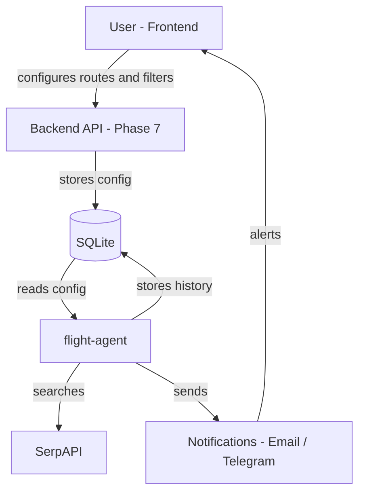
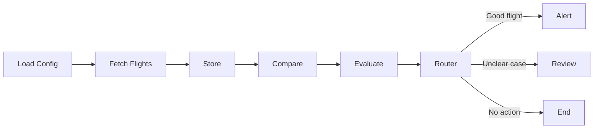

# flight-agent Architecture

## 1. Purpose

`flight-agent` is a Python agent that monitors flight prices for a Thanksgiving 2026 family trip.

Routes:

- LIM -> MAD (Nov 15, 2026)
- MAD -> MCO (Nov 23, 2026 - Thanksgiving window)
- MCO -> LIM (Nov 29, 2026)

The agent searches flights with SerpAPI, stores prices in SQLite, compares them with history, evaluates rules, and decides one of three outcomes:

* **Alert**
* **Review**
* **End**

---

## 2. Framework & Stack

| Component     | Role                                               |
| ------------- | -------------------------------------------------- |
| ReAct Pattern | Makes each step explainable: Think → Act → Observe |
| LangGraph     | Orchestrates the workflow as a graph               |
| SerpAPI       | Provides flight search results                     |
| SQLite        | Stores price history                               |
| Mermaid       | Documents the architecture visually                |
| Markdown      | Keeps documentation simple and readable            |

This document describes architecture, not implementation.

Pattern used: Enterprise Agentic Workflow (Event-driven state machine with bounded agentic subgraphs).

Rule: Code handles the normal process. Rules handle objective decisions. Claude reasons about ambiguous cases. LangGraph orchestrates state, branches, loops and persistence.

---

## 3. High-Level Architecture

### System Context (full system)


### Agent Flow (internal)



The basic flow is:

1. Load monitoring rules.
2. Search current flights.
3. Store the result.
4. Compare against historical prices.
5. Evaluate rules.
6. Route to Alert, Review, or End.

---

## 4. State Definition

`FlightMonitorState` is the shared context of one agent run.

It should contain:

| State Area   | Examples                                                |
| ------------ | ------------------------------------------------------- |
| Config       | routes, max price, max stops, travel window             |
| Current data | fetched flights, normalized flights                     |
| History      | previous prices, historical average, historical minimum |
| Evaluation   | passed rules, failed rules, candidates                  |
| Routing      | decision, reason                                        |
| Output       | alert message or review item                            |

The state is important because it makes the agent traceable.

A good final decision should be explainable from the state.

---

## 5. Node-by-Node Breakdown

| Node          | Think                            | Act                                | Observe                          |
| ------------- | -------------------------------- | ---------------------------------- | -------------------------------- |
| Load Config   | What should be monitored?        | Load routes and rules              | Config is available in state     |
| Fetch Flights | What flights exist now?          | Call SerpAPI                       | Current flight data is available |
| Store         | What should be saved?            | Persist snapshot in SQLite         | Price history is updated         |
| Compare       | Is this price good historically? | Compare current vs previous prices | Price differences are known      |
| Evaluate      | Does it satisfy the rules?       | Apply max price and max stops      | Candidates are identified        |
| Router        | What should happen next?         | Choose Alert, Review, or End       | Decision is stored               |
| Alert         | Is this clearly worth attention? | Prepare/send alert                 | Alert output is created          |
| Review        | Is this ambiguous?               | Create review item                 | Human review output is created   |

---

## 6. Tool Calling

Tools are executable capabilities used by nodes.

| Tool               | Used By       | Purpose                        |
| ------------------ | ------------- | ------------------------------ |
| Flight Search Tool | Fetch Flights | Search flights through SerpAPI |
| Persistence Tool   | Store         | Save observations in SQLite    |
| History Tool       | Compare       | Read previous prices           |
| Rule Tool          | Evaluate      | Check max price and max stops  |
| Notification Tool  | Alert         | Send or prepare alerts         |
| Review Tool        | Review        | Create manual review items     |

Simple rule:

> Nodes organize the workflow. Tools do the work.

---

## 7. LangGraph Orchestration

LangGraph controls the flow between nodes.

It is responsible for:

* running nodes in order
* passing state between nodes
* routing conditionally after evaluation
* ending the run correctly

LangGraph does not decide whether a flight is good.

That decision comes from:

* configured rules
* historical comparison
* evaluation results
* routing logic

The main routing point is:

| Evaluation Result       | Next Step |
| ----------------------- | --------- |
| Clearly good flight     | Alert     |
| Promising but uncertain | Review    |
| Not useful              | End       |

---

## 8. File Structure

```text
flight-agent/
├── ARCHITECTURE.md
├── README.md
├── config/
│   └── routes.yaml
├── data/
│   └── flight_agent.sqlite
├── src/
│   └── flight_agent/
│       ├── graph.py
│       ├── state.py
│       ├── nodes/
│       ├── tools/
│       └── observability/
└── tests/
```

Purpose:

| Folder           | Purpose                      |
| ---------------- | ---------------------------- |
| `config/`        | Route and rule configuration |
| `data/`          | SQLite database              |
| `nodes/`         | Workflow steps               |
| `tools/`         | Reusable capabilities        |
| `observability/` | Logs and traces              |
| `tests/`         | Rule and workflow validation |

Note: MVP uses flat file structure. Will migrate to this structure in Phase 6.

Purpose:

| Folder            | Purpose                      |
| ----------------- | ---------------------------- |
| `config/`         | Route and rule configuration |
| `data/`           | SQLite database              |
| `nodes/`          | Workflow steps               |
| `tools/`          | Reusable capabilities        |
| `observability/`  | Logs and traces              |
| `tests/`          | Rule and workflow validation |

---

## 9. Data Flow Example

Example route:

`LIM → MAD`

Flow:

1. Config says max price is `1200 USD` and max stops is `1`.
2. SerpAPI finds a flight for `870 USD` with `1 stop`.
3. SQLite stores the observation.
4. The agent compares it with history.
5. Historical minimum was `940 USD`.
6. The flight passes price and stop rules.
7. Router chooses `Alert`.
8. The agent prepares an alert explaining why.

---

## 10. ReAct Transparency Example

Scenario:

| Field              | Value     |
| ------------------ | --------- |
| Route              | LIM → MAD |
| Current price      | 870 USD   |
| Max price          | 1200 USD  |
| Stops              | 1         |
| Max stops          | 1         |
| Historical minimum | 940 USD   |

ReAct explanation:

| Step    | Explanation                                                    |
| ------- | -------------------------------------------------------------- |
| Think   | The flight is on a monitored route and may be a good deal      |
| Act     | Compare price, stops, and historical data                      |
| Observe | It is cheaper than the historical minimum and passes the rules |

Final reason:

> Alert triggered because `LIM → MAD` was found at `870 USD`, below the max price of `1200 USD`, within the stop limit, and cheaper than the previous historical minimum of `940 USD`.

---

## 11. Next Phases

| Phase   | Goal                          | Layer               |
| ------- | ----------------------------- | ------------------- |
| Phase 1 | Local agent with console output | Agent             |
| Phase 2 | Scheduled monitoring          | Agent               |
| Phase 3 | Real alerts                   | Notifications       |
| Phase 4 | Manual review queue           | Agent + SQLite      |
| Phase 5 | LLM-assisted explanations     | Agent (Claude)      |
| Phase 6 | Better logging and traces     | Agent + SQLite      |
| Phase 7 | User configuration interface  | Frontend + Backend API |

Note: Backend API appears in Phase 7 only. Phases 1-6 use SQLite internally without exposing an external API.

---

## 12. Architecture Principles

1. Keep hard rules deterministic.
2. Use the LLM for explanation, not hidden control.
3. Keep nodes small.
4. Keep tools reusable.
5. Make every decision traceable.
6. Keep architecture documentation separate from implementation details.

---

## Summary

`flight-agent` is a stateful flight monitoring agent.

Core pattern:

`State + Nodes + Tools + Router`

Core flow:

`Load Config → Fetch Flights → Store → Compare → Evaluate → Router → Alert / Review / End`

The first version should stay simple, deterministic, and easy to inspect.
